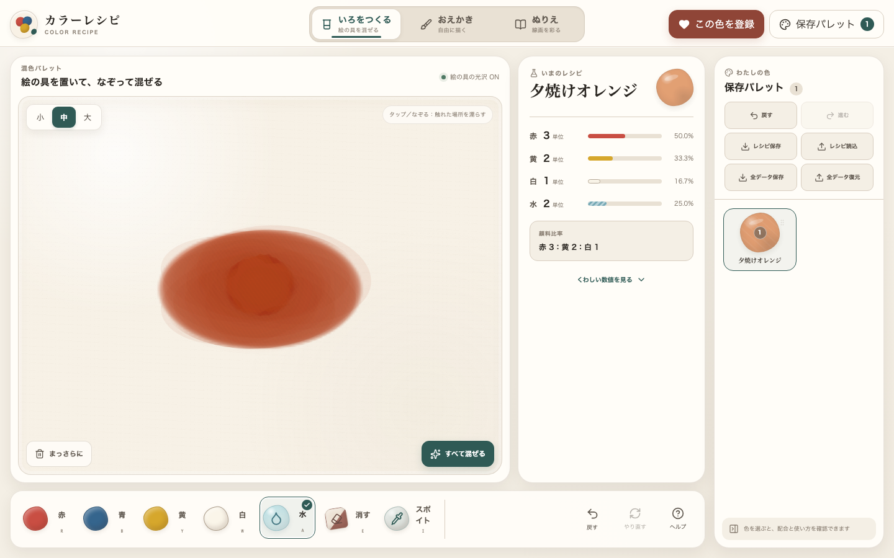
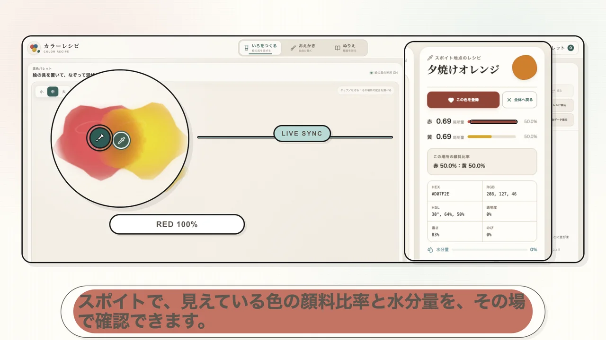
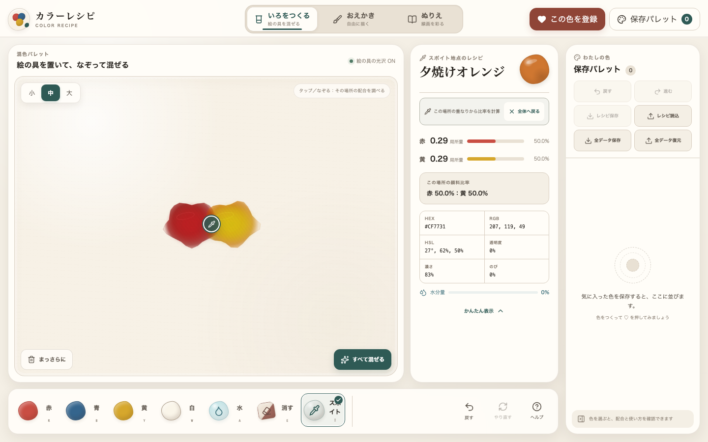
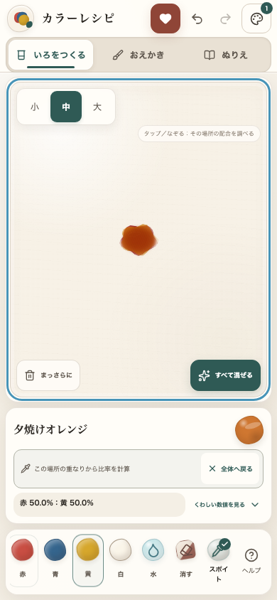

# カラーレシピ

実際の絵の具をパレットへ置き、なぞって混ぜ、水で薄め、その配合を保存できる日本語Webアプリです。作った色は、そのまま「おえかき」と「ぬりえ」で使えます。



## 65秒チュートリアル

[](./public/tutorial/color-recipe-tutorial.mp4)

`nyanluna` の日本語ナレーションと字幕で、混色、スポイト、色登録、水、保存色でのおえかき、枠内を1タップで塗る操作、データ保存までを紹介します。

- [動画を開く](./public/tutorial/color-recipe-tutorial.mp4)
- [日本語字幕](./public/tutorial/color-recipe-tutorial.ja.vtt)
- [文字起こし](./docs/tutorial-transcript.ja.md)

## 主な機能

- 赤・青・黄・白・水を、1タップ＝1単位で正確に記録
- 31波長の反射率とKubelka–Munk K/S近似による減法混色
- 絵の具が重なった場所ごとに局所比率を更新し、表示中の画素色とスポイト地点の配合を保存・再展開
- 水はタップまたはなぞった部分だけへ加わり、離れた絵の具は乾いたまま維持
- 小・中・大の表示サイズ、手混ぜ、「すべて混ぜる」
- 配合比、顔料比、HEX、RGB、HSL、透明度、濃さ、推定色名
- 保存パレットへの登録、1回押しで選択・同じ色の2回目で詳細表示、名称変更、複製、削除、並び替え、再展開、Undo／Redo
- IndexedDBを優先した保存と、全ストアの復旧用LocalStorageミラー
- 版付きレシピJSONと、設定・作品・塗り絵を含む全データバックアップ
- 11種類の描画ツール、筆設定、レイヤー、Undo／Redo、自動保存、PNG出力
- 6種類のオリジナル塗り絵、画像読込、枠内全体を1タップで塗り替える機能、ブラシ塗り、漏れ抑制、PNG出力
- PC、タブレット、スマートフォン対応
- キーボード操作、ARIA、色以外の選択表示、Reduced Motion対応

## 起動方法

必要環境はNode.js 22.13以降です。

```bash
npm ci
npm run dev
```

表示されたローカルURLをブラウザで開きます。

## ビルドとテスト

```bash
# 型、Lint、単体テスト、ビルド、SSRスモークテスト
npm test

# E2Eテスト（テスト用サーバーも自動起動）
npm run test:e2e

# 個別実行
npm run typecheck
npm run lint
npm run test:unit
npm run build

# 画面確認用PNG（先に npm run dev -- --hostname 127.0.0.1 --port 3002）
npm run screenshots
```

## 色混合アルゴリズム

`lib/colorScience.ts` は、赤・青・黄・白をそれぞれ31点（400–700nm）の反射率曲線として扱います。

1. 各波長の反射率 `R` をKubelka–Munkの `K/S = (1 - R)² / (2R)` へ変換
2. 顔料単位と散乱力（白は強い散乱力）でK/Sを加重混合
3. 混合K/Sを反射率へ戻す
4. CIE 1931等色関数とD65光源でXYZへ変換
5. sRGB、HEX、HSLを算出

このためRGB値の平均とは異なり、黄＋青は緑、赤＋青はくすんだ紫、三原色は低彩度のアースカラーになります。水は反射率へ混ぜず、透明度、濃さ、粘度、広がり、乾燥速度へ作用します。白は顔料として明度と被覆力を上げます。

### 局所混色とスポイト

パレットへ置いた各絵の具は1単位のまま記録されますが、表示上は中心から縁へなめらかに薄くなる局所的な重みを持ちます。絵の具同士が重なった場所では、その地点へ届く各材料の重みから顔料比率を更新します。手でなぞった軌跡には操作時点の顔料が引き込まれますが、離れた場所の水は持ち込みません。「すべて混ぜる」では、操作時点の水を含むレシピ全体をなじませます。

水はタップで1単位、なぞると軌跡へ複数の局所配置として追加されます。全体レシピ欄の水は投入総数、スポイト欄の水分量は調べた地点だけの値です。水を置いても、離れた絵の具の透明度や水分量は変わりません。

「スポイト」を選んでパレットをタップ、またはなぞると、マーカー位置の局所量、顔料比率、水分比、色名・HEX・RGB・HSLを表示します。比率は局所配合から計算し、色はその瞬間に画面へ描画されたCanvas/WebGLのRGBAを直接取得するため、光沢や重なりを含む見えている色と登録色がずれません。WebGLを使えない環境では、表示中のCanvas 2D画素へ自動で切り替えます。たとえば赤と黄を同じ強さで重ねた中心は「赤 50.0%：黄 50.0%」となり、赤側へ動かすと赤の比率が上がります。スポイト結果は調査表示であり、全体レシピの投入単位を書き換えません。

「この色を登録」は常にレシピ欄に1個だけ表示されます。スポイト結果を表示したまま押すと、全体配合ではなく、その地点の最新画素色と比率を保った再現用レシピを保存します。顔料合計32単位を基準に整数化するため、赤50%・黄50%なら赤16・黄16です。取得したRGBAは `capturedAppearance` として配合とは分けて保存されるため、再読込後も見た目の色を維持しながら、水分比や顔料比などの物性はレシピから安全に再計算できます。保存詳細には「スポイト地点の局所配合」と記録され、「もう一度つくる」で混色パレットへ再展開できます。顔料のない空白や水だけの地点は、色としては登録できません。





## ぬりえの枠内タップ塗り

「タップで枠内を塗る」は、線画レイヤーを境界として、タップした枠の内側全体を選択色で塗り替えます。以前のブラシ色が残っていても領域を分断せず、同じ枠内をまとめて置き換えます。線は最上層へ残り、線上をタップした場合は塗りません。

「線の感度」で薄い線の認識を、「線のすき間をとじる」で小さな切れ目の補正を調整できます。補正しても閉じられない大きな切れ目がある場合は、ページ全体へ漏らさず塗りを中止します。透明背景のPNGも、透明な余白を線として誤認せず読み込めます。

## レシピJSON

「レシピ保存」で書き出すファイルは、版番号と保存色配列を持つ次の形です。下の例は、赤3・黄2・白1・水2を置いて「すべて混ぜる」を実行した `#D9824A` の実データに合わせています。

```json
{
  "app": "カラーレシピ",
  "version": 1,
  "exportedAt": "2026-07-28T00:01:00.000Z",
  "colors": [
    {
      "id": "color-example",
      "name": "夕焼けオレンジ",
      "note": "夕方の空に",
      "recipe": {
        "red": 3,
        "blue": 0,
        "yellow": 2,
        "white": 1,
        "water": 2
      },
      "mixed": {
        "hex": "#D9824A",
        "rgb": { "r": 217, "g": 130, "b": 74 },
        "hsl": { "h": 23, "s": 65, "l": 57 },
        "pigmentRatio": {
          "red": 0.5,
          "blue": 0,
          "yellow": 0.3333,
          "white": 0.1667
        },
        "opacity": 0.762,
        "waterRatio": 0.25,
        "intensity": 0.573,
        "viscosity": 0.724,
        "spread": 0.413,
        "dryingSpeed": 0.638,
        "name": "夕焼けオレンジ"
      },
      "steps": [
        { "id": "step-r1", "material": "red", "size": "medium", "x": 0.42, "y": 0.45, "createdAt": "2026-07-28T00:00:01.000Z" },
        { "id": "step-r2", "material": "red", "size": "medium", "x": 0.46, "y": 0.46, "createdAt": "2026-07-28T00:00:02.000Z" },
        { "id": "step-r3", "material": "red", "size": "medium", "x": 0.5, "y": 0.47, "createdAt": "2026-07-28T00:00:03.000Z" },
        { "id": "step-y1", "material": "yellow", "size": "medium", "x": 0.54, "y": 0.48, "createdAt": "2026-07-28T00:00:04.000Z" },
        { "id": "step-y2", "material": "yellow", "size": "medium", "x": 0.58, "y": 0.49, "createdAt": "2026-07-28T00:00:05.000Z" },
        { "id": "step-w1", "material": "white", "size": "medium", "x": 0.48, "y": 0.53, "createdAt": "2026-07-28T00:00:06.000Z" },
        { "id": "step-a1", "material": "water", "size": "medium", "x": 0.52, "y": 0.54, "createdAt": "2026-07-28T00:00:07.000Z" },
        { "id": "step-a2", "material": "water", "size": "medium", "x": 0.56, "y": 0.55, "createdAt": "2026-07-28T00:00:08.000Z" }
      ],
      "mixGestures": [
        {
          "id": "mix-all-1",
          "kind": "all",
          "distance": 1200,
          "speed": 0.7,
          "points": 16,
          "recipe": {
            "red": 3,
            "blue": 0,
            "yellow": 2,
            "white": 1,
            "water": 2
          },
          "createdAt": "2026-07-28T00:00:09.000Z"
        }
      ],
      "mixMethod": "すべて混ぜる",
      "createdAt": "2026-07-28T00:00:10.000Z",
      "updatedAt": "2026-07-28T00:00:10.000Z",
      "order": 0
    }
  ]
}
```

`steps` は材料、表示サイズ、パレット上の位置、時刻を投入順に保存します。`mixGestures` は距離、速度、経路、「すべて混ぜる」の有無、操作時点の材料レシピを保存します。スポイト地点から登録した色は局所比率の再現用レシピを正本とし、元の全体配置を持ち込まないため `steps` と `mixGestures` は空になります。その色には任意の `capturedAppearance`（取得時のHEXと透明度）も付きます。

読み込み時は `recipe` を正本とし、`mixed` の顔料比率、水分比、濃さなどを現在の計算エンジンで再計算します。スポイト色に限り、形式と範囲を検証した `capturedAppearance` からHEX・RGB・HSL・透明度を復元します。版付きJSONは現在 `version: 1`、従来の版なし配列も旧版として移行できます。ファイル内で同じIDが重複する項目や、範囲外・不正な項目は安全のため個別に除外されます。読み込む色のIDが端末内の保存色と衝突した場合は、新しいIDを割り当てて両方を残します。

保存パレットの色は1回押すと選択状態になり、同じ色をもう一度押すと詳細を開きます。登録・名称変更・複製・削除・並び替え・読込は50段階までUndo／Redoでき、戻した状態も端末保存へ反映されます。

## 保存仕様

データベース名は `color-recipe-studio` です。

| ストア | 内容 |
| --- | --- |
| `colors` | 保存色、レシピ、順番、メモ |
| `settings` | 最後のモード、選択色、最近使った色、混色・描画・塗り絵の設定 |
| `artworks` | おえかきの全レイヤー、選択レイヤー、背景、用紙サイズ |
| `coloring` | テンプレート・読込線画ごとの塗り進捗 |

各保存操作はIndexedDBとLocalStorageミラーの両方へ試行し、少なくとも一方へ保存できた場合は継続します。読込時はIndexedDBを優先し、利用不能・空・破損時にはミラーから復旧します。壊れた保存色が混在しても、検証を通った色は回収します。データは端末・ブラウザごとのローカル保存です。

「全データ保存」は4ストアを版付きバックアップへまとめます。

```json
{
  "kind": "color-recipe-app-backup",
  "version": 1,
  "exportedAt": "2026-07-28T00:01:00.000Z",
  "stores": {
    "colors": [],
    "settings": [],
    "artworks": [],
    "coloring": []
  }
}
```

「全データ復元」は書き込み前にファイル全体を検証し、通常は既存データと結合します。バックアップと同じ色ID・設定キー・作品キー・塗り絵キーはバックアップ側で更新し、バックアップにない端末側データは残します。レシピJSONと全データバックアップは用途と形式が異なるため、それぞれ専用の読込ボタンを使います。

## セキュリティーとプライバシー

- アカウント、解析タグ、広告、外部フォント、外部APIは使用しません。
- 色、設定、作品、塗り絵はブラウザのIndexedDBとLocalStorageへ保存します。
- 読み込む線画はPNG・JPEG・WebP、8MB以下、最大8192px・3200万画素に制限し、固定サイズのPNGへ再描画して位置情報などの画像メタデータを除去します。
- 全データ復元は、外部URL、SVG画像、過大画像、未対応キャンバス、過剰レイヤー、安全でないオブジェクトキーを、保存前にまとめて拒否します。
- CSP、クリックジャッキング防止、MIMEスニッフィング防止、権限無効化などのレスポンスヘッダーを設定します。
- `NEXT_PUBLIC_SITE_URL` は公開URLだけに使用する非秘密値です。秘密情報はリポジトリや `.env.example` に記録しないでください。

詳しくは [PRIVACY.md](./PRIVACY.md)、脆弱性の報告方法は [SECURITY.md](./SECURITY.md)、公開前の確認項目は [PUBLISHING.md](./PUBLISHING.md) を参照してください。

## フォルダ構成

```text
app/                  画面本体、メタデータ、全体スタイル
components/           混色・描画・塗り絵・保存パレット・ダイアログ
lib/
  colorScience.ts     分光／Kubelka–Munk近似
  paintEngine.ts      ブラシ、合成、線画マスク基準の枠内全体塗り、漏れ抑制、HIDPI補助
  spatialMix.ts       重なり・混色軌跡の局所比率とスポイト計算
  savedColorSchema.ts 版付きレシピJSONの検証と旧版移行
  storage.ts          多重保存と全データバックアップ
  types.ts            レシピ、保存色、ツールの型
  useHistory.ts       安定したUndo／Redo履歴
tests/                単体、SSR、Playwright E2E
screenshots/          PC・スマートフォンの確認画像
public/og.png         共有用プレビュー画像
public/tutorial/       ナレーション・字幕付きチュートリアル
```

## 操作の補助

- `Ctrl/Cmd + Z`: 元に戻す
- `Shift + Ctrl/Cmd + Z`: やり直す
- `Alt + 1 / 2 / 3`: モード切替
- 混色パレットへフォーカスして `Enter` または `Space`: 中央へ1単位追加
- 混色モードの `R / B / Y / W / A / E / I`: 赤／青／黄／白／水／消しゴム／スポイト
- スポイト結果の表示中に `← / ↑ / → / ↓`: 調べる地点を少しずつ移動

## 既知の制限

- 顔料モデルは一般的な画材の挙動を狙った近似で、特定メーカーの実測スペクトルを校正したものではありません。
- 保存は端末ローカルで、複数端末間の同期や共同編集はありません。
- 筆圧はPointer Eventsで値を提供するペン／端末に依存します。
- WebGLが利用できない環境では、混色面はCanvas 2Dの軽量表示へ切り替わります。
- 読み込んだ線画の線が極端に薄い場合は、領域判定の前に画像側のコントラスト調整が必要な場合があります。
- 大きなレイヤーを多数追加すると、モバイル端末では保存容量とメモリの影響を受けます。

## 今後追加できる機能

- 実在顔料セットとメーカー別のスペクトルプロファイル
- 乾燥時間を含む時間変化、紙質ごとのにじみ
- カラーレシピのQR共有、クラウド同期、共同パレット
- 描画レイヤーの並び替え、変形、マスク、選択範囲
- 塗り絵テンプレート追加と線画の自動補正
- Web Worker／OffscreenCanvasによる大判作品の高速化
- PWA、オフライン利用、スタイラス向けジェスチャー

## ライセンス

このプロジェクトは [MIT License](./LICENSE) で公開しています。

Copyright (c) 2026 Lunaneco

動画生成に使用した第三者技術は [THIRD_PARTY_NOTICES.md](./THIRD_PARTY_NOTICES.md) に記載しています。

## スクリーンショット

- [デスクトップ：混色](./screenshots/desktop-mix.png)
- [デスクトップ：重なりの局所比率とスポイト](./screenshots/desktop-spatial-picker.png)
- [スマートフォン：重なりの局所比率とスポイト](./screenshots/mobile-spatial-picker.png)
- [デスクトップ：おえかき](./screenshots/desktop-drawing.png)
- [デスクトップ：ぬりえの枠内タップ塗り](./screenshots/desktop-coloring.png)
- [スマートフォン：混色](./screenshots/mobile-mix.png)
- [スマートフォン：保存パレット](./screenshots/mobile-palette.png)
- [スマートフォン：筆とレイヤーの調整](./screenshots/mobile-drawing-adjustments.png)
